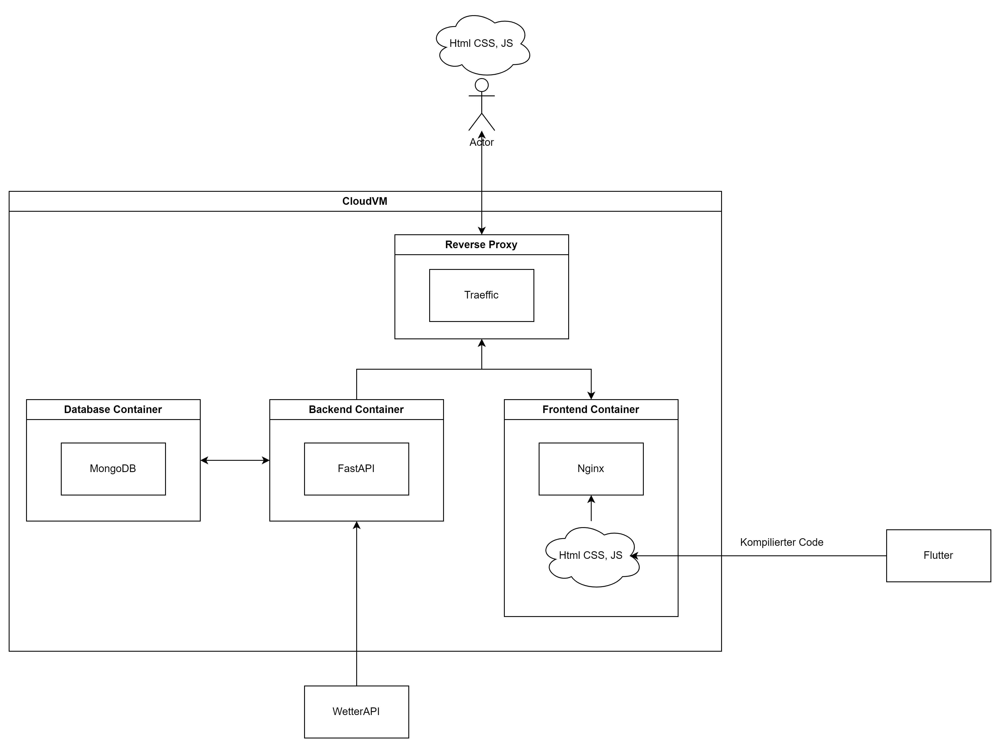

# Wetter Getter Dokumentation

## Beschreibung

Dieses Projekt dient als Vorbereitung zu meiner Bachelorarbeit. In dieser werde ich eine bestehende Applikation zur Cloud als FaaS migrieren. Aus diesem Grund wird in diesem Projekt erst selbst eine klassische Anwendung aufgebaut, um dafür ein allegemeines Verständnis zu entwickeln und um interessante Technologien kennen zu lernen. Danach wird das Projekt zuerst auf eine VM in der Cloud migriert und danach wird die Applikation so umgebaut, dass sie Faas nutzt.

## Big Picture

## Anforderungen

Frontend:

- Jetzige Wetterdaten: Diese werden vom Frontend von der Wetter API angefordert und angezeigt

- Historische Wetterdaten: Nutzer gibt Zeitpunkt an, von dem er die Wetterdaten haben möchte. DIese Anfrage wird an das Backend gestellt 

Backend:

- speichert jede Minute Wetterdaten ab (in MongoDB)

- REST API um Nutzer Wetterdaten zu einem bestimmten Zeitpunk zu geben

FaaS:

- Soll nach Migration genauso funktionieren, wie die Anwendung zuvor

## Fragen die durch das Projekt beantwortet werden sollen

Teil1:

- Wie baut man ein Backend auf?

- Wie funktioniert eine NoSQL Datenbank?

- Wie gut funktoniert Flutter für Webanwendungen?

- WIe baut man eine REST Schnittstelle auf?

- Wie setzt man eine Cloud VM auf?

- Was für Vorteile bietet eine Cloud VM?

- Wie baut man eine echte Anwendung mit Docker?

- Wie können Docker Container miteinander kommunizieren?

- Wie kann man die Anwendung über einen ReverseProxy auf der CloudVM erreichbar  machen?

Teil 2:

- Wie gut lässt sich die Anwendung zu einer FaaS Cloud migirieren?

- Wie wird mit den Docker Container umgegangen?

- WIe geht man mit dem Frontend um. Kann man das auch migrieren als FaaS?

- WIe geht man mit der Datenbank um? (Datenbank auch zu Cloud migrieren, oder auf VM laufen lassen, oder ....)

- Was für Möglichkeiten bietet mir FaaS?

- Wie kann man FaaS nutzen?

- Wann macht es Sinn, wann macht es kein Sinn?

- VOrteile, Nachteile, Alternativen z.B BaaS?

- Migration durchführen

## Zeitplan

1. Container Anwendungen bauen (mit Logik) und im Docker Compose lokal zum Laufen bringen:

    - Docker -> 2 Tage -> 3.04

    - Database Container -> 2 Tage 27.03

    - Backend Container -> 5 Tage 17.03

    - Frontend Container -> 4 Tage 23.03

    - Reverse Proxy -> 3 Tage 30.03

    - Puffer -> 2 Tage

    -> 19 Tage

2. CloudVM das Projekt in eine Cloud VM migrieren in dieser die Anwendung zum Laufen bringen und die Anwendung von außen aufrufbar machen (am besten mitt HTTPS)

    - Zur Cloud migrieren -> 7 Tage 14.04

    -> 7 Tage

3. Backend zu FaaS migrieren

    - Einarbeiten und migrieren -> 9 Tage 28.04

    -> 9 Tage
